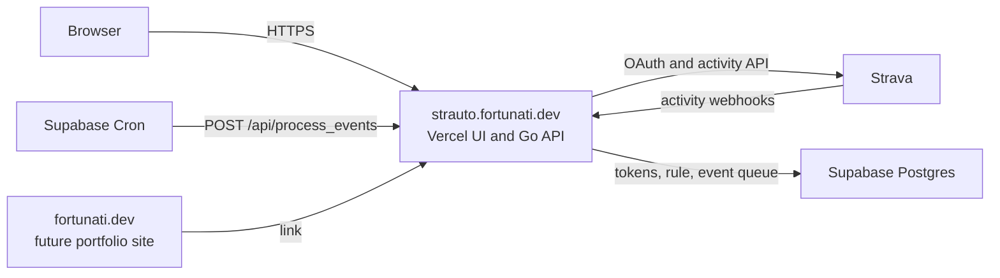

# Architecture and domain layout

The portfolio repository currently contains only a README. Keep the portfolio site and Strauto as separate deployments so work on either site can ship independently. The Strauto subdomain is already connected to Vercel.

| Public address | Project | Purpose |
| --- | --- | --- |
| `https://fortunati.dev` | Future portfolio project | Personal site and a link to Strauto |
| `https://strauto.fortunati.dev` | Existing Strauto Vercel project, root `apps/web` | React app and Go functions under `/api` |

`APP_URL` is the canonical Strauto origin, `https://strauto.fortunati.dev`, without a path. The OAuth callback is `https://strauto.fortunati.dev/api/oauth_callback`. The Strava API application's authorization callback domain should be `strauto.fortunati.dev`; Strava separately allows `localhost` for local development. The webhook callback and worker endpoint live under the same Strauto origin. No portfolio code or reverse proxy is needed for them.

The current `strauto.fortunati.dev` CNAME already points to a Vercel target, and the site responds over HTTPS. Its deployed page is still the old Vite scaffold. Public DNS for the apex `fortunati.dev` does not yet have an A or AAAA record. When you build the portfolio, configure the apex for its own hosting project. Keep the two projects on the same Vercel account if convenient, but give each its own Git repository and environment variables.

The current repo provides the application code and SQL schema. The Vercel project and Strauto DNS record exist. The repo contains no evidence of a configured Supabase project, Strava app registration, webhook subscription, or scheduled Cron job. Those are the remaining integration steps before a real upload can be tested. Deploy this branch only after its server environment variables and database are ready, since the current production site is already live.

The webhook callback currently uses an unguessable `key` query parameter and verifies Strava's subscription ID. Strava's general webhook documentation does not specify a POST signature, although its separate example mentions one without explaining how to obtain a signing secret. Verify the callback URL and delivered headers during the first live subscription setup. Keep the callback URL secret; rotate the key if it leaks.
